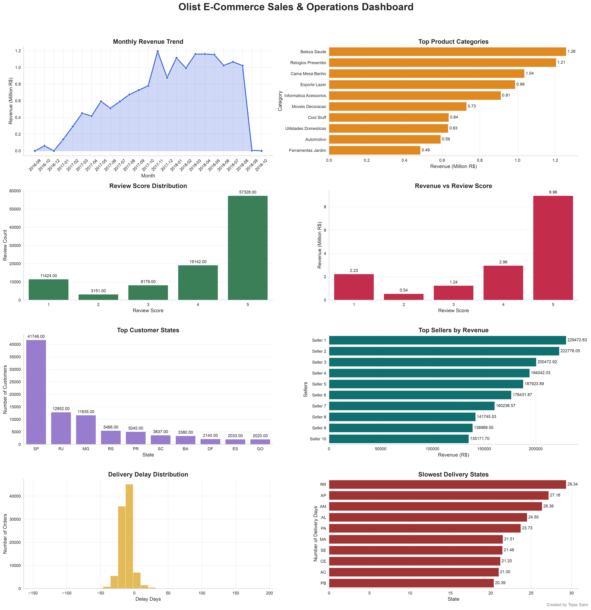
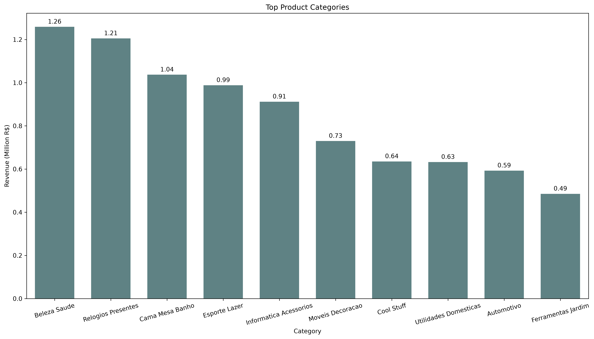

# 🛒 Olist E-Commerce Data Analysis using SQL & Python

## 📌 Project Overview

This project analyzes the Brazilian Olist E-Commerce dataset using **MySQL**, **SQL**, **Pandas**, **Matplotlib**, and **Seaborn** to uncover business insights related to revenue, customers, products, sellers, reviews, and deliveries.

The project demonstrates the complete data analysis workflow, from importing raw CSV files into a relational database to performing SQL analysis and creating insightful visualizations.

---

# 📂 Dataset

**Dataset:** Olist Brazilian E-Commerce Dataset

The dataset contains information about:

- Customers
- Orders
- Order Items
- Products
- Sellers
- Payments
- Reviews
- Geolocation

**Dataset License:** CC BY-NC-SA 4.0
https://www.kaggle.com/datasets/olistbr/brazilian-ecommerce

---

# 🎯 Objectives

The main objectives of this project are:

- Calculate overall business revenue.
- Analyze monthly revenue trends.
- Identify top-performing products and categories.
- Find high-value customers.
- Analyze seller performance.
- Study customer review patterns.
- Evaluate delivery performance.
- Build meaningful business visualizations.

---

# 🛠 Technologies Used

- Python
- MySQL
- SQL
- Pandas
- Matplotlib
- Seaborn
- SQLAlchemy
- python-dotenv
- Jupyter Notebook

---
# 📁 Project Structure

```text
olist-ecommerce-sql-python-analysis/

│
├── data/
│
├── images/
│
├── notebooks/
│   ├── 01_import_mysql.ipynb
│   ├── 02_sql_analysis.ipynb
│   ├── 03_python_eda.ipynb
│   └── 04_dashboard.ipynb
│
├── sql/
│   ├── analysis_queries.sql
│   ├── import_queries.sql
│   └── schema.sql
│
├── .gitignore
├── LICENSE
├── README.md
└── requirements.txt
```

> **Note:** Local development uses a .env file to securely store MySQL credentials. This file is intentionally excluded from version control.


---

# 📊 SQL Analysis

The following business questions were answered using SQL.

## Business KPIs

- Total Revenue
- Total Orders
- Average Order Value

## Customer Analysis

- Monthly Revenue Trend
- Top Spending Customers
- Customers with Highest Number of Orders
- Average Spending by Customer
- Repeat Customers
- Customer Distribution by State

## Product Analysis

- Most Purchased Products
- Highest Revenue Products
- Categories with Highest Revenue
- Average Product Price by Category

## Seller Analysis

- Seller Revenue
- Sellers with Highest Number of Orders
- Average Seller Revenue
- Seller Distribution by State

## Review Analysis

- Review Score Distribution
- Revenue vs Review Score
- Average Review Score by Product Category

## Delivery Analysis

- Average Delivery Time
- Fastest Delivery State
- Slowest Delivery State
- Early Delivered Orders
- Late Delivered Orders
- Delivery Delay Distribution

---

# 📈 Visualizations

The project includes the following visualizations:

- Monthly Revenue Trend
- Top Product Categories by Revenue
- Customer Distribution by State
- Seller Revenue
- Review Score Distribution
- Revenue vs Review Score
- Delivery Delay Distribution
- Slowest Delivery States

---

# 📷 Dashboard



---

# 📷 Sample Visualizations

## Monthly Revenue Trend


---

## Top Product Categories



---

## Review Score Distribution


---

## Seller Revenue


---

# 🔍 Key Insights

- Revenue shows clear monthly fluctuations indicating seasonal buying patterns.
- A few product categories contribute significantly to total revenue.
- Customer ratings are predominantly positive, with most reviews receiving high scores.
- Seller revenue is highly concentrated among a small number of sellers.
- Delivery performance varies considerably across different states.
- Most deliveries are completed on or before the estimated delivery date.

---

# 🚀 Future Improvements

- Interactive dashboard using Power BI or Tableau.
- Customer segmentation using Machine Learning.
- Sales forecasting.
- Recommendation System.
- Customer Lifetime Value (CLV) analysis.

---

# 👨‍💻 Author

**Tejas Saini**

B.Tech Data Science Student

LinkedIn: https://www.linkedin.com/in/tejas-saini-a981a3211/

GitHub: https://github.com/tejassainids